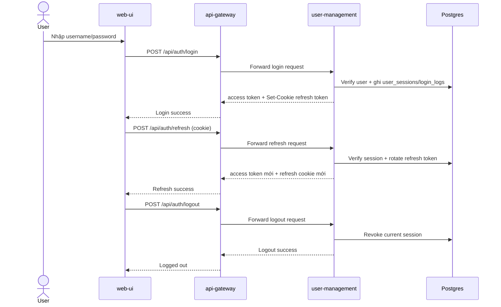
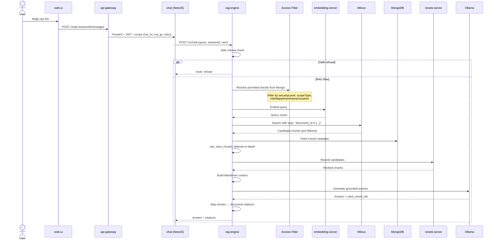
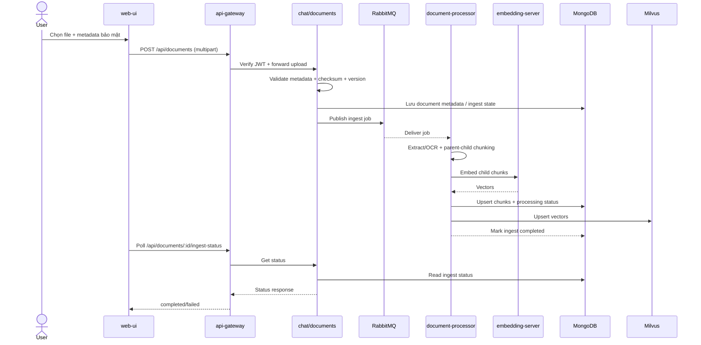
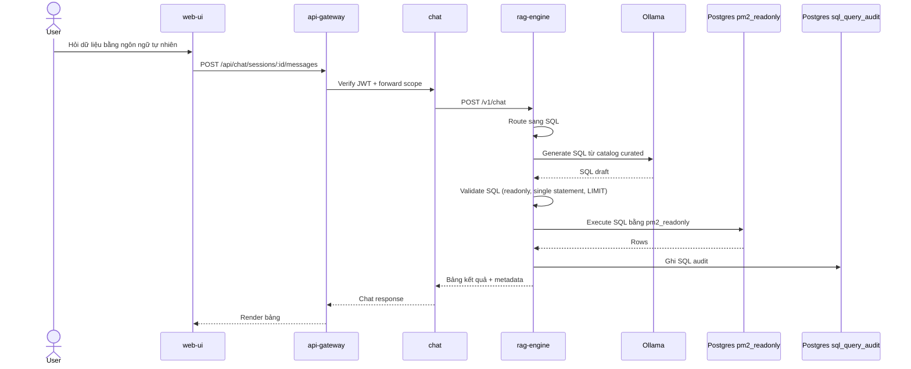
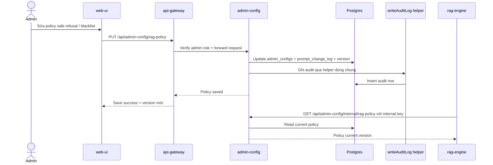
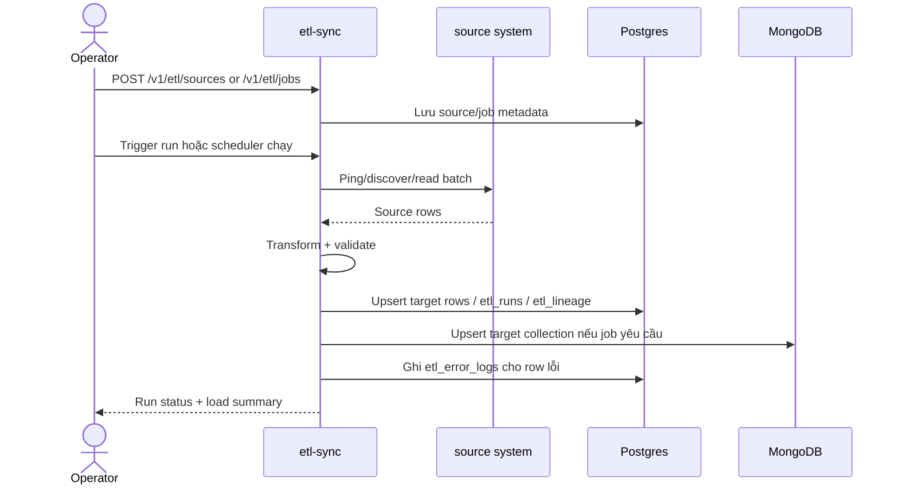
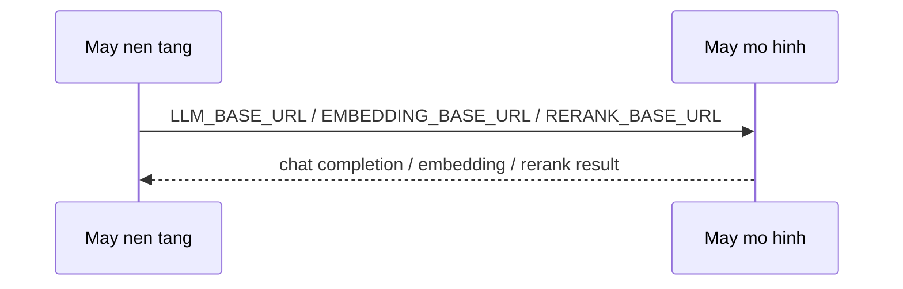
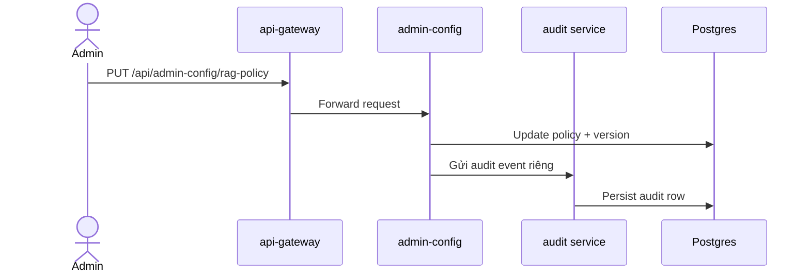
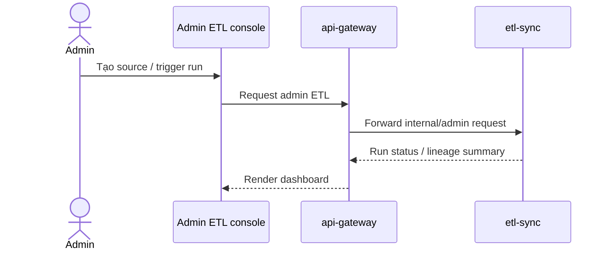

# B7 — Sequence Diagrams

## 1. Mục đích

- Ghi lại các luồng liên service quan trọng để review trước khi đổi flow.
- Tách rõ **Current implementation** và **Target architecture** để tránh nhầm luồng planned là luồng đã có trong repo.

## 2. Current implementation

### 2.1. Login + refresh token + logout

- Happy path: login -> refresh -> logout đi trọn qua gateway và `user-management`.
- Security/audit checkpoint: session lưu ở Postgres; refresh token rotate/revoke.
- Failure/fallback note: sai credential hoặc session hết hạn -> `401`; không có fallback im lặng.

### 2.2. Chat RAG với citation

- Happy path: query đi qua embed -> vector search -> Mongo filter -> rerank -> generate -> citation.
- Security/audit checkpoint: scope người dùng phải theo xuyên suốt từ gateway tới `rag-engine`.
- Failure/fallback note: nếu `rag-engine` unreachable trước khi stream, `chat` có thể fallback một phần; nếu policy chặn -> route `refusal`.

### 2.3. Document upload + ingest + indexing

- Happy path: upload -> queue -> worker -> embed -> Mongo/Milvus -> poll status.
- Security/audit checkpoint: metadata bảo mật được validate ở cả API và worker.
- Failure/fallback note: nếu RabbitMQ chưa sẵn sàng, publish path có HTTP fallback; nếu ingest lỗi, UI đọc `failed` + error.

### 2.4. Text-to-SQL read-only query

- Happy path: route SQL -> generate -> validate -> execute readonly -> format result.
- Security/audit checkpoint: validator chặn DDL/DML và thực thi qua `pm2_readonly`.
- Failure/fallback note: SQL không hợp lệ hoặc user không đủ quyền -> từ chối rõ ràng; không fallback sang query thô.

### 2.5. Admin cập nhật AI policy + audit log

- Happy path: admin cập nhật policy, DB version tăng, audit ghi qua helper, `rag-engine` đọc policy mới.
- Security/audit checkpoint: chỉ admin-like được sửa; internal policy route dùng key riêng và bị chặn khỏi public gateway.
- Failure/fallback note: nếu save lỗi thì policy cũ giữ nguyên; nếu internal fetch lỗi, `rag-engine` dùng cache/fallback an toàn.

### 2.6. ETL source sync + lineage/error log

- Happy path: source -> run -> transform -> load -> lineage/error summary.
- Security/audit checkpoint: connector read-only; password response phải được mask.
- Failure/fallback note: hiện service-level API chưa có auth ở FastAPI layer; row lỗi được cô lập thay vì làm rơi cả batch nếu có thể.

## 3. Target architecture / planned

### 3.1. Two-machine AI topology

- Planned state: app stack và AI serving tách máy.
- Không phải current implementation của `docker-compose.yml`.

### 3.2. Admin policy qua dedicated audit service

- Đây là **target/planned direction** nếu sau này tách rõ đường ghi audit thành service chuyên trách.
- Không mô tả nó như current implementation; current repo đang ghi qua helper dùng chung.

### 3.3. ETL qua admin console/gateway

- Đây là **target/planned** cho khi web-ui có ETL console đầy đủ.
- Current repo mới có service-level API `etl-sync`, chưa có flow web-ui/gateway hoàn chỉnh cho ETL.

## 4. Ghi chú

- Khi implementation thay đổi, cập nhật cả `B3`, `B6`, `B7` cùng nhau.
- Nếu một sơ đồ chỉ đúng ở mức đích kiến trúc, ghi rõ `Target architecture / planned`, không đặt trong `Current implementation`.
