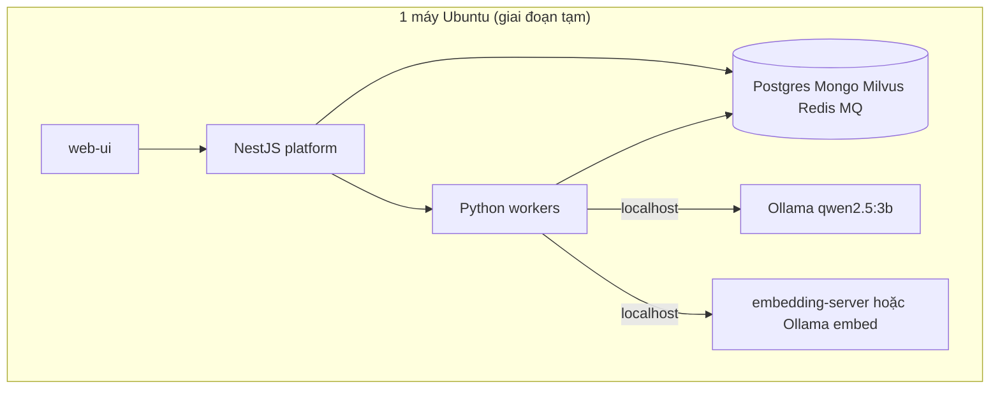
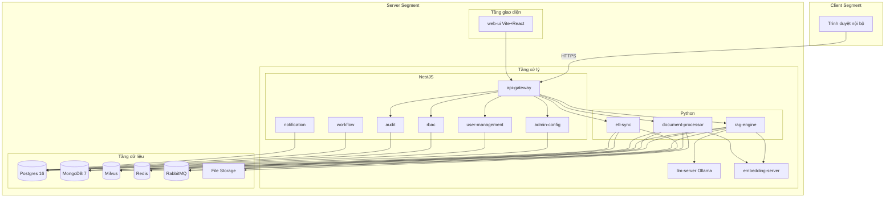
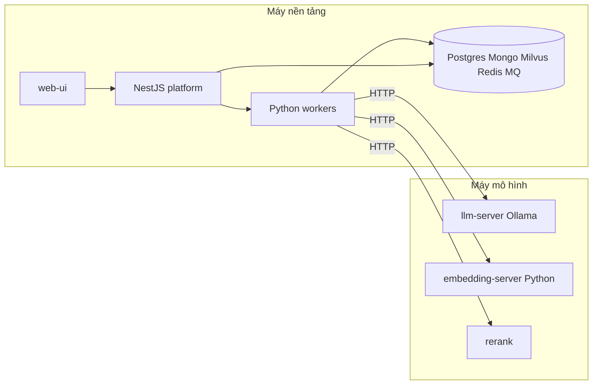
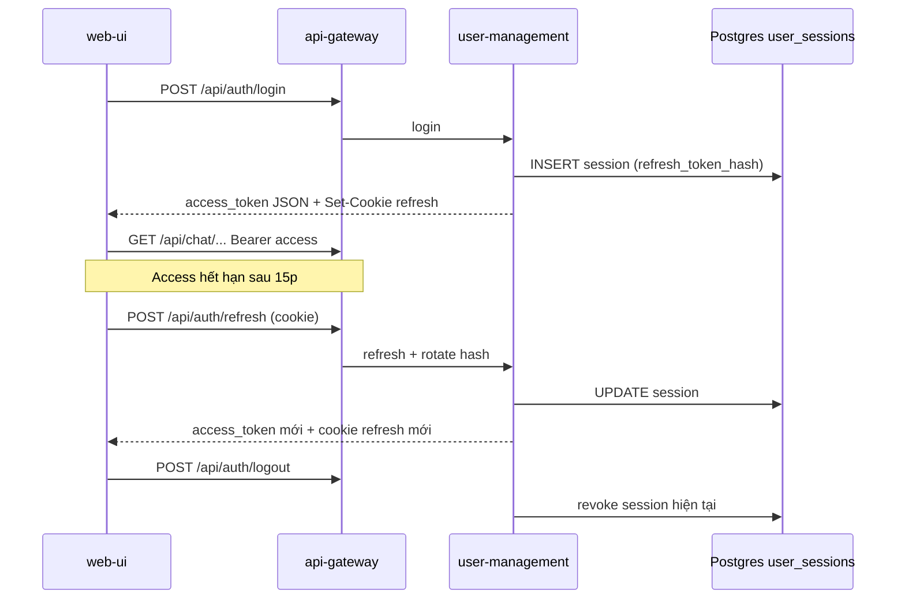
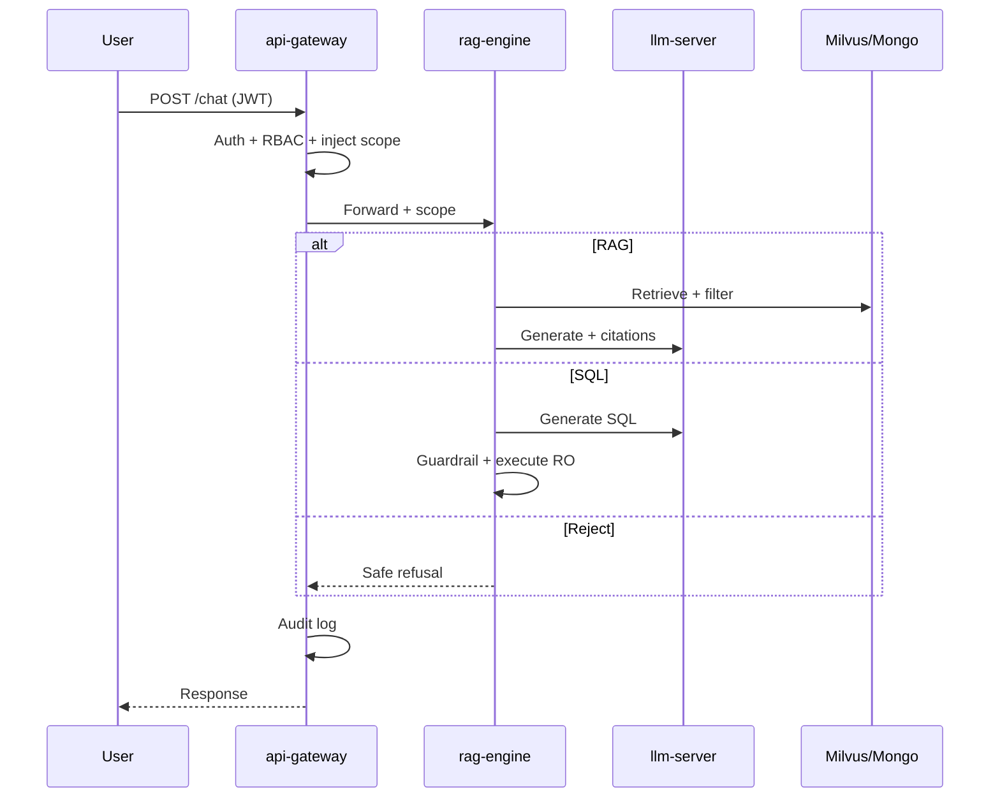

# Kế hoạch triển khai — PM2 Kho dữ liệu tập trung & Cổng khai thác trợ lý ảo

---

## 1. Mục tiêu & phạm vi

- **Mục tiêu:** hệ thống PM2 full-parity, on-premise; hỏi đáp NLP có citation; Text-to-SQL an toàn; RBAC/audit/ETL.
- **Trong phạm vi:** mọi module nghiệp vụ, mọi use case; production khi triển khai sau.
- **Giai đoạn hiện tại (tạm thời):** phát triển trên **1 máy Ubuntu** — gộp Máy nền tảng + AI local (`localhost`); ưu tiên profile `code`, model dev **`qwen2.5:3b`**.
- **Chuẩn nghiệm thu (sau):** dev/test **2 máy** — **Máy nền tảng** (app + data) và **Máy mô hình** (build/serving Qwen3-8B); đổi `LLM_BASE_URL` / `EMBEDDING_BASE_URL` khi có server riêng.
- **Thành công:** traceability 100%, mọi acceptance gate pass với **Qwen3-8B** trên topology 2 máy.

---

## 2. Đầu ra dự án

Đầu ra PM2 **không chỉ là một phần mềm** mà là bộ sản phẩm gồm kho dữ liệu, cổng khai thác, engine AI và tài liệu bàn giao.

**1. Kho dữ liệu tập trung** — *nền tảng dữ liệu* (Postgres, MongoDB, Milvus, File Storage, ETL)

Lưu trữ và chuẩn hóa toàn bộ dữ liệu Học viện: giáo trình, học liệu, tài liệu nghiên cứu, khảo thí, học viên/giảng viên, văn bản hành chính, metadata (kể cả nguồn camera khi có). Đánh chỉ mục semantic và metadata phân quyền.

**2. Cổng khai thác trợ lý ảo (Web Portal)** — *sản phẩm người dùng nhìn thấy* (`web-ui`, Vite + React)

Giao diện chat kiểu ChatGPT: hỏi đáp tài liệu, tra cứu, tìm văn bản, truy vấn dữ liệu, self-service, admin.

**3. Hệ thống AI RAG** — *engine AI lõi* (`rag-engine` + `llm-server` + `embedding-server`)

Nhận câu hỏi → tìm tài liệu liên quan → trích xuất ngữ cảnh → sinh câu trả lời có citation bằng LLM.

**4. Chức năng AI đầu ra** — *tính năng trên cổng*, chạy qua RAG + guardrail

Tóm tắt tài liệu · sinh câu hỏi kiểm tra/quiz · gợi ý học liệu · hỗ trợ soạn giáo án · trả lời từ kho dữ liệu · Text-to-SQL.

---

## 3. Quy tắc triển khai (tóm tắt)

Full parity · Model nghiệm thu **Qwen3-8B** · OpenAI-compatible API · On-premise first · Phân tầng · **Hiện tại: 1 máy Ubuntu** · Chuẩn sau: **2 máy** (Nền tảng + Mô hình) · Cấu hình tách code · Bảo mật mặc định · Tái lập được (Docker Compose).

### 3.1. Môi trường dev tạm thời — 1 máy Ubuntu

> Topology **2 máy** vẫn là thiết kế chuẩn và mục tiêu nghiệm thu. Giai đoạn bootstrap **chỉ có 1 máy** — toàn bộ stack chạy trên cùng host Ubuntu cho đến khi có Máy mô hình riêng.

**OS & công cụ**

- **Ubuntu** 22.04 hoặc 24.04 LTS (cài native, hoặc WSL2 trên Windows với distro Ubuntu).
- Docker Engine + Docker Compose v2; Node.js LTS; Python 3.12 — cài trên Ubuntu, không phụ thuộc Windows runtime khi dev trong WSL.

**Phần cứng tham chiếu (máy dev hiện tại)**

- RAM ~16 GB — **không đủ** để chạy đồng thời full stack Docker (5 kho DB + Milvus) **và** Ollama Qwen3-8B.
- iGPU (Intel Arc) — không dùng cho serving 8B nặng trên laptop; AI local dùng **`qwen2.5:3b`** (CPU/GPU nhẹ).

**Chiến lược 1 máy**

| Giai đoạn | Compose / AI | Ghi chú |
| --------- | ------------ | ------- |
| M0 | `docker compose --profile code up` | App + 5 kho DB; **chưa** bắt buộc profile `ai` |
| M1 (tạm) | Cùng máy: Ollama `localhost` + **`qwen2.5:3b`** | `LLM_BASE_URL=http://localhost:11434`, `LLM_MODEL=qwen2.5:3b`; đủ smoke RAG/SQL dev |
| Nghiệm thu | Tách Máy mô hình: profile `ai`, **Qwen3-8B** | Đổi URL trong `.env`; smoke cross-host |

**Giới hạn RAM trên Ubuntu**

- Trước `compose up`: mục tiêu RAM hệ thống **~60–65%** (đóng tab trình duyệt nặng; giữ IDE).
- Docker Compose: `mem_limit` / `deploy.resources.limits` cho Postgres, Milvus, Mongo — tránh OOM kill toàn stack.
- WSL2 (nếu dùng): giới hạn RAM WSL qua `.wslconfig` (`memory=…`) — Ubuntu trong WSL **không tạo thêm RAM** vật lý.
- **Không** chạy song song: full profile `code` + Ollama 8B trên 16 GB.

**Luồng làm việc khuyến nghị**

1. Scaffold repo + migration (không cần Docker nặng).
2. Bật profile `code` → seed + smoke M0.
3. Cài Ollama trên Ubuntu (host hoặc container nhẹ) → `ollama pull qwen2.5:3b` → nối `rag-engine`.
4. Khi có server Máy mô hình: profile `ai` riêng, pull Qwen3-8B, cập nhật `.env`, chạy A-09 smoke cross-host.



---

## 4. Kiến trúc tổng quan




**Triển khai vật lý — hiện tại (1 máy Ubuntu):** xem §3.1.

**Triển khai vật lý — chuẩn nghiệm thu (2 máy):**



### 4.3. Xác thực Access + Refresh Token

Hệ thống dùng **hai loại token** thay cho một JWT dài hạn:

| Token | TTL | Lưu trữ | Mục đích |
| ----- | --- | ------- | -------- |
| **Access token** | 15 phút | `localStorage` (frontend) | `Authorization: Bearer` cho mọi API |
| **Refresh token** | 7 ngày | **HttpOnly cookie** (`pm2_refresh_token`) | Chỉ gọi `/api/auth/refresh` để cấp access mới |



**Triển khai:** `user-management` phát hành token; `api-gateway` proxy cookie + CORS `credentials`; `chat`/`rag-engine` chỉ validate access JWT.

---

### 4.1. Hạ tầng (Infrastructure)

> **Máy nền tảng** — máy code chính. **Máy mô hình** — máy build và serving model AI.

**Thiết kế:** Client + Server (3 tầng logic).

**Giai đoạn tạm (1 máy Ubuntu)** — §3.1:

- Cùng host: profile `code` + Ollama/embedding qua `localhost`
- `.env`: `LLM_BASE_URL=http://localhost:11434` (hoặc port embedding tương ứng)
- Model dev **`qwen2.5:3b`** (`LLM_MODEL` trong `.env`); **không** dùng Qwen3-8B làm gate M0–M4 trên laptop 16 GB

**Chuẩn nghiệm thu (2 máy):**

- **Máy nền tảng** — UI, NestJS platform, Python workers (RAG, ingest, ETL), toàn bộ kho dữ liệu
- **Máy mô hình** — `llm-server` (**Ollama**), `embedding-server` (Python), rerank (GPU khuyến nghị)

**Mục tiêu giai đoạn:** profile `code` chạy ổn trên 1 máy Ubuntu; khi có Máy mô hình — profile `ai` riêng, smoke cross-host.

**Hạng mục chính:**

- Monorepo `pm2/`; `docker-compose.yml` + profile `code` / `ai`; `mem_limit` trên Ubuntu 16 GB
- `.env.example`: biến localhost (1 máy) và biến IP nội bộ (2 máy)
- Healthcheck từng profile; smoke **intra-host** (giai đoạn tạm) → smoke cross-host (nghiệm thu)
- README: quickstart **1 máy Ubuntu** (hiện tại) + mục bổ sung **2 máy** khi tách Máy mô hình

---

### 4.2. Hệ thống — Lập trình (Services)

**Thiết kế:** NestJS platform + Python AI/workers + Ollama LLM; REST/OpenAI-compatible; RabbitMQ; Redis.

**NestJS** (`services/platform/`)

- `api-gateway` — điểm vào duy nhất: routing, JWT, proxy
- `admin-config` — cấu hình AI/policy có version
- `user-management` — IAM, user, đơn vị
- `rbac` — phân quyền, row-level, inject scope
- `audit` — audit log immutable
- `workflow` — luồng phê duyệt / trạng thái
- `notification` — thông báo in-app, event hook

**Python 3.12**

- `rag-engine` — RAG, Text-to-SQL orchestration, refusal
- `embedding-server` — BGE-M3, 1024 chiều
- `document-processor` — ingest pipeline
- `etl-sync` — đồng bộ + lineage

**Ollama**

- `llm-server` — Qwen3-8B, OpenAI-compatible API

**Frontend:** `web-ui` (Vite + React)

**Mục tiêu giai đoạn:** scaffold Nest monorepo + Python service template + `libs/` trước khi xây nghiệp vụ.

**Hạng mục chính:**

- NestJS monorepo (gateway + modules nội bộ)
- Python workers: `libs/ai-clients`, `libs/schemas`, `libs/prompts`, `libs/policies`
- Contract test Nest ↔ Python ↔ Ollama

---

## 5. Kiến trúc tầng giao diện (Presentation / `web-ui`)

**Thiết kế:** Vite + React + React Router; phân vùng route theo role; JWT qua Gateway; streaming SSE cho chat.

```text
/login → /chat (user)     → citation, upload, quiz, self-service
       → /admin (admin)   → audit, ETL, config, health, IAM
       → /docs            → upload, ingest status, tra cứu
```

**Mục tiêu giai đoạn:** người dùng và admin thao tác đầy đủ luồng; chat streaming có citation click-through.

**Hạng mục chính:**

- Khung app, routing theo role, đăng nhập JWT
- Chat streaming, citation, xem nguồn
- Không gian tài liệu: upload, theo dõi ingest, tra cứu
- Self-service học viên và admin dashboard
- Quiz, tóm tắt, audit, cấu hình AI, quản lý tài khoản

---

## 6. Kiến trúc tầng xử lý (Processing)

**Thiết kế:** NestJS platform + Python AI/workers + Ollama; 3 luồng — Chat/RAG, Text-to-SQL, Document ingest (+ ETL).




**Mục tiêu giai đoạn:** điều phối nghiệp vụ + AI an toàn, có grounding và guardrail, mọi request truy vết được.

**Hạng mục chính:**

- NestJS: `api-gateway`, `rbac`, `audit`, `user-management`, `admin-config`, `workflow`, `notification`
- Python: `rag-engine`, `document-processor`, `etl-sync`
- Ollama: `llm-server`; Python: `embedding-server` (Máy mô hình)
- Test tích hợp Nest ↔ Python ↔ Ollama

---

## 7. Lộ trình milestone

**Thứ tự:** M0 → M1 → M2 → (M3 ∥ M4) → M5 → M6

```text
M0 ──► M1 ──► M2 ──► M3 ──┐
              │            ├──► M5 ──► M6
              └────────► M4 ──┘
```

---

#### M0 — Chuẩn bị nền & dữ liệu mẫu

> **Khối SP** · 1 Kho dữ liệu tập trung (nền)  
> **Phụ thuộc** · —  
> **Workstream** · A, C, H

**Mục tiêu** — Nền kỹ thuật + 5 kho dữ liệu + seed + bộ tài liệu mẫu sẵn sàng cho ingest.

**DoD**

- **M0 · 1 máy Ubuntu:** `docker compose --profile code up` — app stack + 5 kho DB chạy ổn định trên Ubuntu; seed + tài liệu mẫu sẵn sàng; `mem_limit` đã cấu hình; README quickstart **1 máy Ubuntu** (profile `code`)
- **M0 · chưa bắt buộc:** profile `ai`, Qwen3-8B, smoke cross-host — hoãn đến khi có Máy mô hình hoặc đủ RAM

**Deliverable**

- **#1 Kho dữ liệu tập trung** *(nền)* — Postgres, MongoDB, Milvus, Redis, RabbitMQ, File Storage; migration + seed
- **#9 Bộ dữ liệu mẫu** *(file thô)* — `data/sample-docs/` + seed DB
- **#10 Tài liệu bàn giao** *(quickstart)* — README profile `code` trên Ubuntu; ghi chú lộ trình lên 2 máy

---

#### M1 — LLM Server & Embedding Server

> **Khối SP** · 3 Hệ thống AI RAG (tầng serving)  
> **Phụ thuộc** · M0  
> **Workstream** · B

**Mục tiêu** — Serving LLM + embedding; app gọi được qua HTTP (localhost hoặc Máy mô hình riêng).

**DoD — giai đoạn tạm (1 máy Ubuntu)**

- Ollama trên cùng máy: **`qwen2.5:3b`** + embed; `libs/ai-clients` smoke **localhost** pass
- Embedding: BGE-M3 (container hoặc service nhẹ) **hoặc** embed qua Ollama nếu RAM chật — ghi rõ trong README dev

**DoD — nghiệm thu (khi có Máy mô hình)**

- `docker compose --profile ai up` — **Qwen3-8B** + BGE-M3 (+ rerank) healthy
- Smoke cross-host: `LLM_BASE_URL` / `EMBEDDING_BASE_URL` trỏ IP Máy mô hình; latency baseline
- README bổ sung quickstart **2 máy**

**Deliverable**

- **#6 LLM Server** — `llm-server` **Ollama**, OpenAI-compatible API *(dev: `qwen2.5:3b` · nghiệm thu: Qwen3-8B)*
- **#7 Embedding Server** — BGE-M3, 1024 chiều
- **#10 Tài liệu bàn giao** — README profile `ai` + hướng dẫn đổi URL 1 máy → 2 máy

---

#### M2 — Document Processor (ingest pipeline)

> **Khối SP** · 1 Kho dữ liệu (ingest & index) · 3 RAG (dữ liệu sẵn sàng retrieve)  
> **Phụ thuộc** · M0, M1  
> **Workstream** · D

**Mục tiêu** — Pipeline ingest: upload → queue → OCR/extract → chunk → embed → Mongo + Milvus.

**DoD**

- Ingest thành công bộ tài liệu mẫu
- Truy ngược file → trang → chunk

**Deliverable**

- **#1 Kho dữ liệu tập trung** *(ingest/index)* — catalog + vector đã populate
- **#8 Document Processing Pipeline** — `document-processor`: OCR/extract, chunk, embed, index
- **#9 Bộ dữ liệu mẫu đã ingest** — seed DB + vector/catalog index, truy ngược được

---

#### M3 — RAG Engine

> **Khối SP** · 3 Hệ thống AI RAG (engine lõi) · 4 Chức năng AI (hỏi đáp có citation)  
> **Phụ thuộc** · M1, M2  
> **Workstream** · E, J

**Mục tiêu** — Lõi RAG: router, retrieval có filter quyền, rerank, citation, multi-turn, safe refusal.

**DoD**

- RAG eval đạt ngưỡng
- Citation truy ngược nguồn
- Safe refusal hoạt động

**Deliverable**

- **#3 Hệ thống RAG** — `rag-engine`: router, retrieval, rerank, grounding, citation, multi-turn, refusal

---

#### M4 — Text-to-SQL

> **Khối SP** · 4 Chức năng AI đầu ra (Text-to-SQL)  
> **Phụ thuộc** · M0, M1 · khuyến nghị sau M3  
> **Workstream** · F

**Mục tiêu** — Truy vấn SQL an toàn trên dữ liệu có cấu trúc.

**DoD**

- SQL đúng nghiệp vụ trên curated views
- Guardrail chặn câu nguy hiểm; audit SQL đầy đủ

**Deliverable**

- **#4 Text-to-SQL** — sinh SQL an toàn, guardrail, curated views, audit SQL

---

#### M5 — API Gateway: Auth, RBAC, Audit

> **Khối SP** · 1 Kho dữ liệu (phân quyền & audit) · nền cho 2 Portal  
> **Phụ thuộc** · M0 · tích hợp M3/M4 khi sẵn sàng  
> **Workstream** · G, H

**Mục tiêu** — Cổng vào duy nhất; JWT; RBAC + row-level; audit immutable; ETL connector/sync chạy được.

**DoD**

- RBAC đúng vai trò; không rò rỉ ngoài quyền
- Mọi request quan trọng có audit log
- ETL H-02–H-06: connector, batch/event/manual sync, transform/load — lineage đầy đủ

**Deliverable**

- **#5 API Gateway + Auth + RBAC** — NestJS: `api-gateway`, `user-management`, `rbac`, `audit`, routing
- **#1 Kho dữ liệu tập trung** *(bảo mật/ETL)* — IAM, audit; pipeline ETL từ nguồn PM (H-02–H-06)

---

#### M6 — Web UI (Vite) + Eval

> **Khối SP** · 2 Cổng khai thác Web Portal · 4 Chức năng AI đầu ra đầy đủ  
> **Phụ thuộc** · M2–M5  
> **Workstream** · H, I, J, K

**Mục tiêu** — UI hoàn chỉnh; bộ eval chức năng và chất lượng; **nghiệm thu 10/10 deliverable**.

**DoD**

- UAT pass toàn module
- Eval report đủ nhóm: RAG · SQL · security · OCR/ingest
- Hoàn tất bốn khối sản phẩm logic

**Deliverable**

- **#2 Cổng trợ lý ảo Web UI** — `web-ui` Vite + React: chat, citation, upload, tra cứu, self-service, admin; quiz, tóm tắt, gợi ý học liệu, soạn giáo án
- **#10 Tài liệu bàn giao** *(hoàn chỉnh)* — hướng dẫn sử dụng, báo cáo eval/UAT

---

### Checklist — Deliverable nghiệm thu

Checklist hội đồng — artifact chi tiết tại từng milestone ở trên.


| #   | Deliverable                  | Milestone    |
| --- | ---------------------------- | ------------ |
| 1   | Kho dữ liệu tập trung        | M0 → M2 → M5 |
| 2   | Cổng trợ lý ảo Web UI        | M6           |
| 3   | Hệ thống RAG                 | M3           |
| 4   | Text-to-SQL                  | M4           |
| 5   | API Gateway + Auth + RBAC    | M5           |
| 6   | LLM Server                   | M1           |
| 7   | Embedding Server             | M1           |
| 8   | Document Processing Pipeline | M2           |
| 9   | Bộ dữ liệu mẫu đã ingest     | M0 → M2      |
| 10  | Tài liệu bàn giao            | M0 → M6      |


---

## 8. Ma trận milestone ↔ workstream


| Workstream        | M0  | M1  | M2  | M3  | M4  | M5  | M6  |
| ----------------- | --- | --- | --- | --- | --- | --- | --- |
| A Bootstrap       | ●   |     |     |     |     |     |     |
| B LLM/Embedding   |     | ●   |     | ●   | ●   |     |     |
| C Data platform   | ●   |     | ●   | ●   | ●   | ●   |     |
| D Ingest          |     |     | ●   |     |     |     |     |
| E RAG             |     |     |     | ●   |     | ●   |     |
| F Text-to-SQL     |     |     |     |     | ●   | ●   |     |
| G Auth/RBAC       |     |     |     |     |     | ●   |     |
| H ETL             | ●   |     |     |     |     | ●   | ●   |
| I Nghiệp vụ       | ●   |     |     | ●   | ●   |     | ●   |
| J Trợ lý nâng cao |     |     |     | ●   |     |     | ●   |
| K Web UI          |     |     |     |     |     |     | ●   |


---

## 9. Tiêu chí nghiệm thu

**Dev tạm (1 máy Ubuntu, M0–M5)**

- Profile `code` healthy; smoke intra-host pass; RAM ổn định với `mem_limit`.
- AI dev: **`qwen2.5:3b`** + localhost — đủ tích hợp `rag-engine`, không thay gate chất lượng cuối (Qwen3-8B).

**Nghiệm thu dự án (topology 2 máy + Qwen3-8B)**

- Mọi service có healthcheck; **Máy nền tảng** + **Máy mô hình** theo profile; smoke cross-host pass.
- RAG: mỗi câu có citation truy ngược; SQL: 100% câu độc hại bị chặn; RBAC: 100% test pass.
- ETL: 100% run có lineage.
- Eval bắt buộc: RAG · SQL · Security/red-team · OCR/ingest · UAT theo module — với **Qwen3-8B**.
- Đủ 10 deliverable trong checklist milestone; mỗi deliverable có artifact chứng minh (service chạy, demo, báo cáo test).

